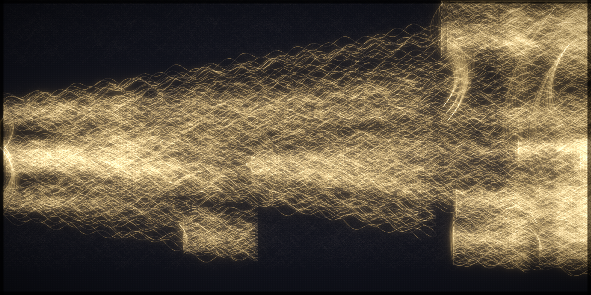

# Look iteration 01

Params: fast (2200x1100), budget_lit=90k, dark=30k, default render params.

## Scores (0–2)
1. Single bright seed at left-center: **1** — bright at left but a broad band, no point.
2. Fan by distance, Christ centered: **0** — dense central horizontal bar; no fan to edges.
3. Organic braid, no straight arcs: **1** — wispy/organic but noisy, undifferentiated.
4. Three shades read (gold/gray/dark): **0** — uniform cream; no gray/gold separation.
5. Right blazes + filled top-to-bottom: **0** — big DARK VOIDS top & bottom; central only.
6. Additive bloom over woven dark ground: **1** — glow present but milky, ground lost.
7. Pure light, no dots/UI: **1** — pure, BUT blocky rectangular artifacts.

**Total: 4/14** (zeros on 2,4,5). Far from reference.

## Diagnosis
- Central bar = antiquity Roman/Mediterranean threads persist full-width & bright; the
  light never "moves outward" → apply the Roman/Med antiquity fade to thread counts.
- Milky/overexposed: gains + tone_k + bloom too high; ground too light → darken, raise
  contrast, thinner fibers.
- Blocky rectangles: dark warp + dense lineage cells at tight y/x → more jitter, fainter
  & more varied dark warp.
- No fan to edges: edge regions (Americas top, Asia/Pacific bottom) under-represented &
  fade masked by center → fade center, boost edge spread, bigger brighter seed point.

## Next (i02)
Roman/Med fade in thread counts; darker/higher-contrast render; bigger seed; more
y-jitter; fainter varied dark warp.
