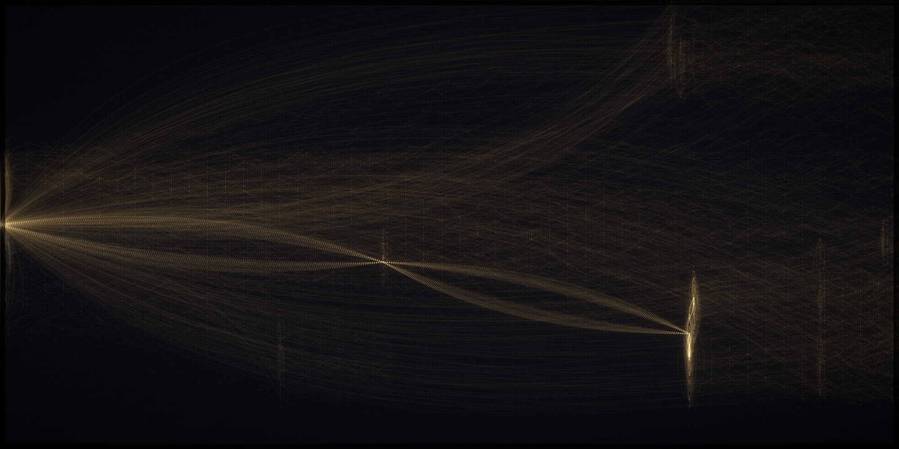

# Look iteration 03 — chain threads

Switched to lineage CHAINS: each leaf traced back to the seed, rendered as one bowed
sweeping curve. Big structural win.

## Scores (0–2)
1. Single seed at left-center: **2** — clear bright origin point, threads emanate. ✓
2. Fan by distance, Christ centered: **2** — genuine fan, up & down from center. ✓
3. Organic braid, no straight arcs: **2** — bowed beziers sweep & braid. ✓
4. Three shades read: **1** — gold visible, gray faint, dark ok.
5. Right blazes + filled top-to-bottom: **0** — INVERTED: bright at seed (left), tapers
   right; right edge sparse, top/bottom-right dark.
6. Bloom over woven dark ground: **1** — ground good & dark now; glow modest.
7. Pure light, no dots/UI: **1** — pure, but faint vertical "comb" streaks at some x.

**Total: 9/14** (zero on 5). Structure solved; brightness distribution inverted.

## Diagnosis
- All chains converge at the seed → left is densest. Reference blazes RIGHT (modern
  billions). Need: many more modern threads + chain intensity RAMPING toward the leaf
  (right) so density accumulates on the right; brighter gold + bloom.
- Vertical combs: many chains share an ignition decade x → waypoint column; soften with
  more bow + jitter on waypoint x.

## Next (i04)
Ramp chain intensity seed→leaf; raise budget (more modern chains) + gold gain + bloom;
slightly dim the seed so the right can dominate; jitter waypoint x.
