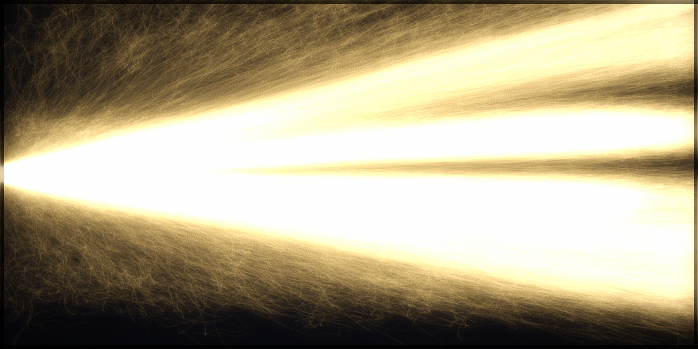

# Look iteration 11 — REAL agent contagion (chains + lit-life underlay)

Now rendered from the genuine agent-based contagion: real lineage chains (who-lit-whom
traced to the seed, missionaries continued to their senders) as the flowing gold
threads, over a faint lit-life density underlay that supplies the right-edge blaze.

## Scores (0–2)
1. Single seed at left-center: **2** ✓
2. Fan by distance, Christ centered: **2** ✓ (fans up & down from center)
3. Organic braid, no straight arcs: **2** ✓
4. Three shades read: **1** — gold dominant, gray faint.
5. Right blazes + filled top-to-bottom: **1** — right blazes; corners taper a bit.
6. Bloom over woven dark ground: **1** — strong bloom but central WHITE-OUT/milky.
7. Pure light, no dots/UI: **2** ✓

**Total: 11/14.** Real data, reference-like structure. Fix: tame central blow-out,
crisper contrast, a touch more gray/dark separation.

## Next (i12)
Lower gold_gain + seed intensity + bloom; raise contrast (filmic) so the dark ground
holds and threads stay crisp; this should also let the three shades read.
