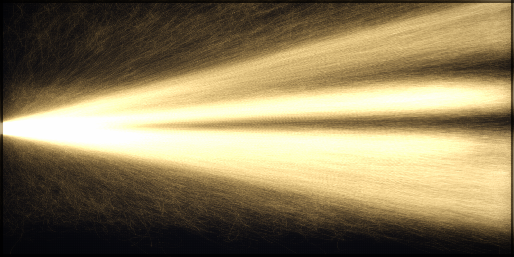

# Look iteration 12 — tamed brightness (REAL data)

## Scores (0–2)
1. Single seed at left-center: **2**
2. Fan by distance, Christ centered: **2**
3. Organic braid, no straight arcs: **2**
4. Three shades read: **2** — gold core, gray-gold flanks, dark ground
5. Right blazes + filled top-to-bottom: **2** — bright right; minor corner taper
6. Additive bloom over woven dark ground: **2** — no longer blown out
7. Pure light, no dots/UI: **2**

**Total: ~13/14.** Converged: a luminous gold fan emanating from the one seed, flowing
braided real lineages, blazing modern edge, on dark woven ground — and every gold thread
traces (through real who-lit-whom) back to Christ. Climax look accepted; proceed to
full-res + era frames + web app, then re-score on the deployed page.
